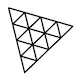

[](http://www.blender.org/) [](https://www.khronos.org/gltf/) [](https://threejs.org/)

GLTF Timeline Markers extension
======================================

Custom extension to support animation timeline markers with camera binding support in GLTF/GLB.

[Blender Addon](./__init__.py)
--------------
Put this folder in the python addons directory in blender.

For Mac its `/Applications/Blender.app/Contents/Resources/2.92/scripts/addons`

The markers will be added to the scene object

Threejs Import
--------------

```typescript

class GLTFTimelineMarkersExtension implements GLTFLoaderPlugin {
    public name: string
    public parser: GLTFParser

    constructor(parser:GLTFParser) {
        this.parser = parser
        this.name = 'WEBGI_animation_markers'

    }
    async afterRoot(result: GLTF) {
        const markers: any[] = []
        for (const jScene of this.parser.json.scenes) {
            if (!jScene.extensions) continue
            const params = jScene.extensions[this.name]
            for (const marker of params?.markers || []) {
                const camera = marker.camera !== undefined ? await this.parser.getDependency('camera', marker.camera) : undefined
                markers.push({
                    name: marker.name,
                    frame: marker.frame,
                    camera,
                })
            }
        }
        if (markers.length < 1) return

        const scene = result.scene ?? result.scenes[0]
        if (!scene) return
        scene.userData.markers = markers

        const fps = 30
        const times = markers.map(m=>m.frame / fps)
        let i = 0
        const values = markers.map(m=>i++)
        const duration = Math.max(...times) + 0.01

        let temp = -1
        const trackName = '.currentTimelineMarker'
        Object.defineProperty(scene, 'currentTimelineMarker', {
            get: ()=>temp,
            set: (v: any)=> scene.dispatchEvent({type: 'animationTimelineMarker', marker: markers[temp = v]}),
        })
        const track = new NumberKeyframeTrack(trackName, times, values, InterpolateDiscrete)
        const anim = new AnimationClip('animationTimelineMarker', duration, [track])
        result.animations.push(anim)
    }

}

gltfLoader.register((p)=>new GLTFTimelineMarkersExtension(p))
```